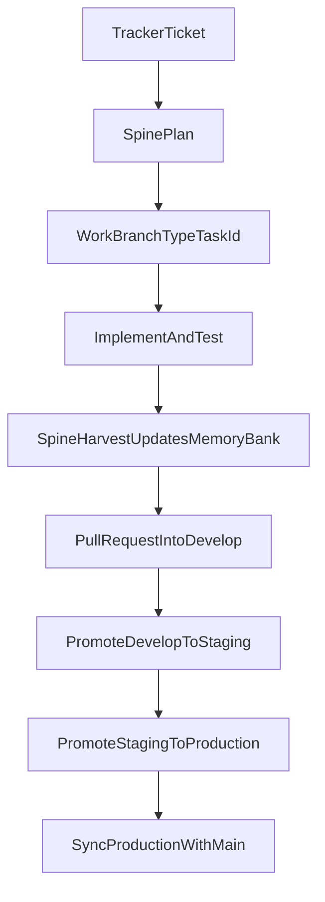

# SPINE

SPINE is the backbone framework on top of which coding agents operate.

It is a reusable set of instructions for teams: rules, a memory bank, and slash commands that give every
agent and every teammate the same delivery workflow. One Python script installs it into a project as real,
committable files — no Bash, no PowerShell, no symlinks, no admin rights, no network.

## What you get

- **Delivery workflow** — plan, execute with tests, harvest, Pull Request.
- **Memory bank** (`docs/memory/`) — context, decisions, progress, and tasks, shared through git.
- **Rules** — three short files every agent reads, reached from the project's `AGENTS.md`.
- **Commands** — `/spine-bootstrap`, `/spine-plan`, `/spine-execute`, `/spine-harvest`, `/spine-commit`.
- **Skills** — nine workflow skills loaded on demand.

## Requirements

- Python 3.9 or newer, standard library only (`python --version`; `py -3` also works on Windows).
- A local copy of this repository (git clone or unpacked `.zip`).
- Nothing else: no admin rights, no Developer Mode, no package installs.

## Install

Run from anywhere, pointing at the project root and choosing the IDEs your team uses:

```
python C:\tools\spine\spine.py install C:\dev\my-project --ides claude,cursor
```

Preview first with `--dry-run` (prints the plan, writes nothing):

```
python C:\tools\spine\spine.py install C:\dev\my-project --ides claude,cursor --dry-run
```

Then commit everything that was created and run `/spine-bootstrap` in the IDE.

| Option | Meaning |
|---|---|
| `TARGET` | Project root. Default: current directory. |
| `--ides` | Comma-separated: `claude`, `cursor`, `antigravity`, `windsurf`. Required on the first install; later runs reuse the previous selection. |
| `--dry-run` | Show `CREATE` / `UPDATE` / `REMOVE` / `SKIP` and write nothing. |
| `--force` | Overwrite command pointers you edited by hand. Never applies to `AGENTS.md`, `CLAUDE.md`, or `docs/`. |

### What gets created

```text
my-project/
├── AGENTS.md                     created once; the hub every agent reads
├── CLAUDE.md                     created once (Claude Code): "@AGENTS.md"
├── .spine/                       single source of truth, managed by spine.py
│   ├── spine.py                  doctor
│   ├── manifest.json             what was generated (hashes, no timestamp)
│   ├── commands/                 full command instructions
│   ├── rules/                    01-core-protocol, 02-memory-bank, 03-code-quality
│   └── skills/                   workflow skills
├── docs/                         created once; never overwritten
│   ├── memory/                   global/, ledger/, active_tasks/, completed_tasks/
│   ├── governance/  quality/  workflow/
├── .claude/commands/spine-*.md   thin pointers to .spine/commands/
└── .cursor/commands/spine-*.md   thin pointers to .spine/commands/
```

Three kinds of files, three rules:

| Kind | Paths | Behavior on every run |
|---|---|---|
| Mirror | `.spine/**` | Made equal to the Spine clone. Do not edit by hand. |
| Pointer | per-IDE command files | Rewritten when missing or untouched; your edits are kept unless `--force`. |
| Seed | `AGENTS.md`, `CLAUDE.md`, `docs/**` | Created only when missing. Never overwritten. |

If the project already has an `AGENTS.md`, it is left alone: the Spine hub is written to
`.spine/AGENTS.snippet.md` for you to merge by hand, and `doctor` warns until `AGENTS.md` references `.spine/rules`.

The installer never touches `.gitignore`. Everything it creates is meant to be committed, so teammates get
Spine with `git pull`.

### Supported IDEs

| `--ides` | Rules | Command pointers | Status |
|---|---|---|---|
| `claude` | `CLAUDE.md` → `@AGENTS.md` | `.claude/commands/` | Known layout |
| `cursor` | `AGENTS.md` at the root | `.cursor/commands/` | **A VERIFICAR** |
| `antigravity` | `AGENTS.md` at the root | `.agents/workflows/` (or `.agent/workflows/`) | **A VERIFICAR** |
| `windsurf` | `AGENTS.md` at the root | `.windsurf/workflows/` | **A VERIFICAR** |

Rows marked **A VERIFICAR** have not been checked by hand against the IDE yet; `install` and `doctor` print
a note for them. The paths live in one table (`IDE_LAYOUTS` in `spine.py`).

## Update

Update your Spine clone, then run `install` again. Without `--ides` it reuses the previous selection:

```
python C:\tools\spine\spine.py install C:\dev\my-project
```

Running it twice in a row changes nothing. Dropping an IDE from `--ides` removes its untouched pointers.

## Doctor

From the project root:

```
python .spine/spine.py doctor
python .spine/spine.py doctor --task docs/memory/active_tasks/PROJ-123-social-login.md
```

`doctor` checks that `.spine/` is a real directory that matches its manifest, that files are UTF-8 without BOM,
that every selected IDE has one pointer per command, that the memory bank seed files exist, that `AGENTS.md`
references `.spine/rules`, and that no two tasks share a `task_id`. `--task` validates one task file against
the task contract. Exit code 0 means OK (warnings allowed); 1 means at least one error.

If `git` converts files to CRLF on checkout, `doctor` reports a warning. Adding `* text=auto eol=lf` to the
project's `.gitattributes` avoids it.

## Team workflow

1. **Ticket** — every task starts from a ticket in your tracker. Its ID (for example `PROJ-123`) is the task ID.
2. **`/spine-plan PROJ-123 <goal>`** — writes `docs/memory/active_tasks/PROJ-123-<name>.md` with an `owner`,
   acceptance criteria, and a test strategy, then validates it.
3. **`/spine-execute <task file>`** — syncs `develop`, creates the branch `<type>/<task-id>`, implements test-first.
4. **`/spine-harvest <task file>`** — updates the memory bank, moves the task to `completed_tasks/`, commits,
   pushes, and stops.
5. **Pull Request** — the branch reaches `develop` only through a reviewed Pull Request.

Branches: `main`, `develop`, `staging`, `production`, and work branches `<type>/<task-id>` where `<type>` is one of
`feat`, `fix`, `docs`, `refactor`, `test`, `chore`, `hotfix`, `release`. Promotion goes
`develop` → `staging` → `production` → `main`. Details: `docs/workflow/gitflow-operacional.md` in the project.



## Memory Bank v2.1

Operational source of truth: `docs/memory/` (Markdown in git). Canonical spec: `rules/02-memory-bank.md`.

```text
docs/memory/
  global/              # Stable context (brief, glossary, patterns, decisions)
  ledger/
    roadmap.md         # Milestones maintained by the team
    progress.md        # Team blockers and next steps + append-only delivery log
    learnings.md       # Recurrence registry (LEARN-NNN)
  active_tasks/        # Open work; each file has an owner and a status
  completed_tasks/     # DONE tasks (moved at harvest via git mv)
```

**Tiered SYNC:**

| Tier | When | Read |
|------|------|------|
| Core | Every session | global 1–6, progress Current state, open `active_tasks/` |
| Extended | Plan, harvest, ambiguous scope | `roadmap.md`, full delivery log |
| On demand | Debugging, recurrence | `learnings.md`, `completed_tasks/` |

## Developing Spine

```
pytest tests/
```

See [`AGENTS.md`](AGENTS.md) for the repository layout and the contract `spine.py` must keep.

## References and Credits

This repository is a fork of [SPINE](https://github.com/fjuste/spine) by Fernando Juste, adapted for
teams working on locked-down Windows machines.

SPINE was inspired by practical community work, especially:

- [antigravity-awesome-skills](https://github.com/sickn33/antigravity-awesome-skills)
- [Cursor Memory Bank (gist)](https://gist.github.com/ipenywis/1bdb541c3a612dbac4a14e1e3f4341ab)
