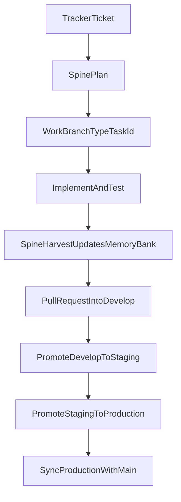

# Spine

A shared delivery workflow for coding agents and the teams that work with them.

Spine is a reusable set of instructions — rules, a memory bank, and slash commands — that gives every agent
and every teammate the same way of planning, building, and handing off work. One Python script installs it
into a project as real, committable files: no Bash, no PowerShell, no symlinks, no admin rights, no network.

## Contents

- [Features](#features)
- [Requirements](#requirements)
- [Quick start](#quick-start)
- [Installation](#installation)
- [Usage](#usage)
- [Updating](#updating)
- [Health checks](#health-checks)
- [Troubleshooting](#troubleshooting)
- [Migrating from the shell installers](#migrating-from-the-shell-installers)
- [Uninstalling](#uninstalling)
- [Contributing](#contributing)
- [Credits](#credits)

## Features

- **Delivery workflow** — plan, execute with tests, harvest, Pull Request.
- **Memory bank** (`docs/memory/`) — context, decisions, progress, and tasks, shared through git.
- **Rules** — three short files every agent reads, reached from the project's `AGENTS.md`.
- **Commands** — `/spine-bootstrap`, `/spine-plan`, `/spine-execute`, `/spine-harvest`, `/spine-commit`.
- **Skills** — nine workflow skills loaded on demand.
- **One-file installer** — `spine.py` installs, updates, and checks a project; running it twice changes nothing.

## Requirements

- Python 3.9 or newer, standard library only (`python --version`; `py -3` also works on Windows).
- A local copy of this repository (git clone or unpacked `.zip`).
- Nothing else: no admin rights, no Developer Mode, no package installs.

## Quick start

1. Get a local copy of Spine, outside your project:

   ```
   git clone https://github.com/gabrielaalves-selbetti/spine C:\tools\spine
   ```

2. Preview what would be written to your project (nothing is changed):

   ```
   python C:\tools\spine\spine.py install C:\dev\my-project --ides claude,cursor --dry-run
   ```

3. Install:

   ```
   python C:\tools\spine\spine.py install C:\dev\my-project --ides claude,cursor
   ```

4. Commit everything that was created, then run `/spine-bootstrap` in the IDE.

The same commands work on macOS and Linux with POSIX paths, for example
`python3 ~/tools/spine/spine.py install ~/dev/my-project --ides claude`.

## Installation

`install` runs from the Spine clone and points at the project root. It copies files into the project, never
touches the network, and never writes outside the project.

```
python C:\tools\spine\spine.py install [TARGET] --ides <list> [--dry-run] [--force]
```

### Options

| Option | Meaning |
|---|---|
| `TARGET` | Project root. Default: current directory. |
| `--ides` | Comma-separated: `claude`, `cursor`, `antigravity`, `windsurf`. Required on the first install; later runs reuse the previous selection. |
| `--dry-run` | Show `CREATE` / `UPDATE` / `REMOVE` / `SKIP` and write nothing. |
| `--force` | Overwrite command pointers you edited by hand. Never applies to `AGENTS.md`, `CLAUDE.md`, or `docs/`. |

### What gets created

```text
my-project/
├── AGENTS.md                     created once; the hub every agent reads
├── CLAUDE.md                     created once (Claude Code): "@AGENTS.md"
├── .spine/                       single source of truth, managed by spine.py
│   ├── spine.py                  doctor
│   ├── manifest.json             what was generated (hashes, no timestamp)
│   ├── .gitattributes            keeps .spine/ on LF line endings
│   ├── commands/                 full command instructions
│   ├── rules/                    01-core-protocol, 02-memory-bank, 03-code-quality
│   └── skills/                   workflow skills
├── docs/                         created once; never overwritten
│   ├── memory/                   global/, ledger/, active_tasks/, completed_tasks/
│   ├── governance/  quality/  workflow/
├── .claude/commands/spine-*.md   thin pointers to .spine/commands/
└── .cursor/commands/spine-*.md   thin pointers to .spine/commands/
```

The installer never touches `.gitignore`. Everything it creates is meant to be committed, so teammates get
Spine with `git pull`.

### File classes

Three kinds of files, three rules:

| Kind | Paths | Behavior on every run |
|---|---|---|
| Mirror | `.spine/**` | Made equal to the Spine clone. Do not edit by hand. |
| Pointer | per-IDE command files | Rewritten when missing or untouched; your edits are kept unless `--force`. |
| Seed | `AGENTS.md`, `CLAUDE.md`, `docs/**` | Created only when missing. Never overwritten. |

### Existing `AGENTS.md`

If the project already has an `AGENTS.md`, it is left alone: the Spine hub is written to
`.spine/AGENTS.snippet.md` for you to merge by hand, and `doctor` warns until `AGENTS.md` references
`.spine/rules`.

### Supported IDEs

| `--ides` | Rules | Command pointers | Status |
|---|---|---|---|
| `claude` | `CLAUDE.md` → `@AGENTS.md` | `.claude/commands/` | Known layout |
| `cursor` | `AGENTS.md` at the root | `.cursor/commands/` | **A VERIFICAR** |
| `antigravity` | `AGENTS.md` at the root | `.agents/workflows/` (or `.agent/workflows/`) | **A VERIFICAR** |
| `windsurf` | `AGENTS.md` at the root | `.windsurf/workflows/` | **A VERIFICAR** |

Rows marked **A VERIFICAR** have not been checked by hand against the IDE yet; `install` and `doctor` print
a note for them. The paths live in one table (`IDE_LAYOUTS` in `spine.py`).

## Usage

### Commands

| Command | Purpose |
|---|---|
| `/spine-bootstrap` | Assess the project and fill the memory bank |
| `/spine-plan` | Turn a tracker ticket into a task plan |
| `/spine-execute` | Implement an active task with tests |
| `/spine-harvest` | Close the task, update the memory bank, hand off to a Pull Request |
| `/spine-commit` | Commit with branch safety checks |

Each IDE gets one thin pointer file per command; the full instructions live in `.spine/commands/`. If the IDE
does not show a command, open its instructions file there and follow it.

### Team workflow

1. **Ticket** — every task starts from a ticket in your tracker. Its ID (for example `PROJ-123`) is the task ID.
2. **`/spine-plan PROJ-123 <goal>`** — writes `docs/memory/active_tasks/PROJ-123-<name>.md` with an `owner`,
   acceptance criteria, and a test strategy, then validates it.
3. **`/spine-execute <task file>`** — syncs `develop`, creates the branch `<type>/<task-id>`, implements test-first.
4. **`/spine-harvest <task file>`** — updates the memory bank, moves the task to `completed_tasks/`, commits,
   pushes, and stops.
5. **Pull Request** — the branch reaches `develop` only through a reviewed Pull Request.

Branches: `main`, `develop`, `staging`, `production`, and work branches `<type>/<task-id>` where `<type>` is one of
`feat`, `fix`, `docs`, `refactor`, `test`, `chore`, `hotfix`, `release`. Promotion goes
`develop` → `staging` → `production` → `main`. Details: `docs/workflow/gitflow-operacional.md` in the project.



### Memory Bank v2.1

Operational source of truth: `docs/memory/` (Markdown in git). Canonical spec: `rules/02-memory-bank.md`
(`.spine/rules/02-memory-bank.md` in an installed project).

```text
docs/memory/
  global/              # Stable context (brief, glossary, patterns, decisions)
  ledger/
    roadmap.md         # Milestones maintained by the team
    progress.md        # Team blockers and next steps + append-only delivery log
    learnings.md       # Recurrence registry (LEARN-NNN)
  active_tasks/        # Open work; each file has an owner and a status
  completed_tasks/     # DONE tasks (moved at harvest via git mv)
```

**Tiered SYNC:**

| Tier | When | Read |
|------|------|------|
| Core | Every session | global 1–6, progress Current state, open `active_tasks/` |
| Extended | Plan, harvest, ambiguous scope | `roadmap.md`, full delivery log |
| On demand | Debugging, recurrence | `learnings.md`, `completed_tasks/` |

## Updating

Update your Spine clone, then run `install` again. Without `--ides` it reuses the previous selection:

```
python C:\tools\spine\spine.py install C:\dev\my-project
```

Running it twice in a row changes nothing. Files that left the Spine clone are removed from `.spine/`, and
dropping an IDE from `--ides` removes its untouched pointers. Commit the result so teammates get the update.

## Health checks

From the project root:

```
python .spine/spine.py doctor
python .spine/spine.py doctor --task docs/memory/active_tasks/PROJ-123-social-login.md
```

`doctor` checks that `.spine/` is a real directory that matches its manifest, that files are UTF-8 without BOM,
that every selected IDE has one pointer per command, that the memory bank seed files exist, that `AGENTS.md`
references `.spine/rules`, and that no two tasks share a `task_id`. `--task` validates one task file against
the task contract.

Exit code 0 means OK (warnings allowed); 1 means at least one error. `OK:` lines go to stdout;
`ERROR:`, `WARNING:`, and `NOTE:` lines go to stderr.

## Troubleshooting

| Message | Cause | Fix |
|---|---|---|
| `--ides is required on the first install` | The project has no `.spine/manifest.json` yet. | Pass `--ides`, for example `--ides claude,cursor`. |
| `unknown IDE(s): ...` | A key in `--ides` is not supported. | Use `claude`, `cursor`, `antigravity`, or `windsurf`. |
| `install must run from the Spine clone` | `install` was run from the copy at `.spine/spine.py`. | Run `install` from your Spine clone; the copy in the project is for `doctor`. |
| `.spine is a link or a file (legacy install?)` | `.spine` was left by an old installer. | Remove it and install again. See [Migrating](#migrating-from-the-shell-installers). |
| `refusing to write through a link` | A managed path is a symlink or junction. | Replace the link with a real directory, or remove it, and install again. |
| `... was edited locally; not overwritten (use --force)` | A command pointer was changed by hand (`SKIP`). | Keep your edit, or pass `--force` to restore the generated pointer. |
| `AGENTS.md exists and does not reference .spine/rules` | The project had its own `AGENTS.md`. | Merge `.spine/AGENTS.snippet.md` into it by hand. |
| `content differs from the installed version` | A file under `.spine/` was edited. | Run `install` again; change Spine in the clone, not in the project. |
| `unreadable manifest` | `.spine/manifest.json` is damaged. | Delete it and run `install` again with `--ides`. |
| `generated file(s) have CRLF line endings` | Git converts line endings on checkout. | Add `* text=auto eol=lf` to the project's `.gitattributes`. |
| `.gitignore ignores a path Spine expects to be committed` | `.spine` or an IDE directory is ignored. | Remove that line from `.gitignore` and commit the files. |
| `duplicate task_id ...` | Two task files share one tracker ID. | Keep one file per task; delete or rename the other. |

## Migrating from the shell installers

Earlier versions of Spine were installed with `install.sh` / `install.ps1` and relied on symlinks. `spine.py`
replaces them and writes real files only. To move a project over:

1. Remove the old `.spine` from the project, whether it is a link or a directory. `install` refuses a linked
   `.spine`, and files left in an old directory are not in the manifest, so they would never be cleaned up.
2. Remove the Spine symlinks left in the IDE directories (`.claude/`, `.cursor/`, ...). `install` refuses to
   write through a link.
3. Run `install` with `--ides` as in [Quick start](#quick-start). Your existing `AGENTS.md` and `docs/` are
   kept as they are.
4. Run `python .spine/spine.py doctor`. It warns about leftovers from the old installers (`.spine-vendor`,
   `opencode.json`, `.opencode`); delete the ones your project does not use for anything else.

## Uninstalling

There is no uninstall command. Remove the generated files by hand:

1. Delete `.spine/`.
2. Delete the `spine-*.md` pointers from each IDE directory (`.claude/commands/`, `.cursor/commands/`,
   `.agents/workflows/`, `.windsurf/workflows/`).

`AGENTS.md`, `CLAUDE.md`, and `docs/` belong to the project. Keep them, or remove the Spine references from
them, as the team prefers.

## Contributing

Run the tests from the Spine repo root:

```
pytest tests/
```

Try the installer against a scratch directory before changing it:

```
python spine.py install /path/to/scratch --ides claude,cursor --dry-run
python spine.py install /path/to/scratch --ides claude,cursor
python spine.py doctor /path/to/scratch
```

See [`AGENTS.md`](AGENTS.md) for the repository layout, the code style, and the contract `spine.py` must keep.

## Credits

This repository is a fork of [SPINE](https://github.com/fjuste/spine) by Fernando Juste, adapted for
teams working on locked-down Windows machines.

SPINE was inspired by practical community work, especially:

- [antigravity-awesome-skills](https://github.com/sickn33/antigravity-awesome-skills)
- [Cursor Memory Bank (gist)](https://gist.github.com/ipenywis/1bdb541c3a612dbac4a14e1e3f4341ab)
